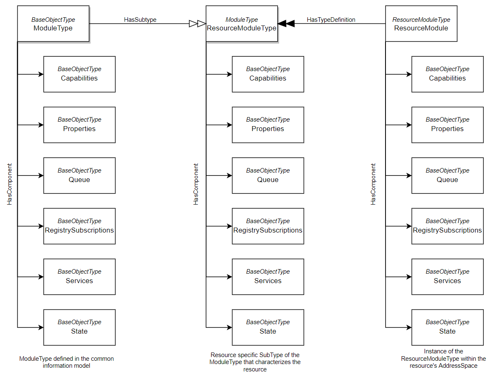
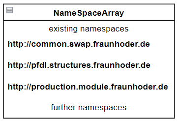

# Common Information Model

The common information model is the basis to make any OPC UA server compatible with the SWAP IT architecture. The Model 
consits of a ModuleType which is required by an Execution Engine to execute an underlying Service. Besides it contains 
a set of data types that are required to provide a specific kind of information in a generic way, such as a data type for queues.
Th following will explain the model in more detail

    

## Provided Files
The data provided in this repository contains a *.ModelDesign File of the common Namespace. The additional files are created with the UA-ModelCompiler 
(https://github.com/OPCFoundation/UA-ModelCompiler) and provided in this repository. The purpose of these files can be looked up in the corresponding 
OPC specifications

Even though the files are provided in this repository, they can be recreated  with the UA-ModelCompiler, using the CommonModelDesig.xml file as input. 
    
1. **CommonModelDesign.xml**: Input file for the UA-ModelCompiler containig the ModelDesign format of the common model
2. **CommonModelDesign.csv**: Numeric identifiers for the elements of the common model  
3. **SWAP.Fraunhofer.Common.Model.NodeSet2.xml**: Contains the concrete Information Model to be uploaded into an OPC UA Server
4. **SWAP.Fraunhofer.Common.Model.NodeSet2.bsd**: files to describe data types of the information model as defined in OPC UA Spec Part 3 Annex C

## Build Documentation
To build the documentation, sphinx and the sphinx rtd themes are required. Both can be installed with:

    pip install sphinx 
    pip install sphinx-rtd-theme

Build the documentation:

    cd swap-it-open62541-server-template
    sphinx-build -M html docs/source/ docs/build/

## Instantiating individual Modules 

The Instantiation of a SWAP Module within a OPC UA Server requires a definition of a SubType of the ModuleType. This SubType requires the addition a ServiceMethod, 
where the BrowseName of this ServiceMethod corresponds to the name of the service specified within a PFDL description. Since the ServiceFinishedEventType has the Mandatory properties, task_uuid and service_uuid, it is required 
to add two input arguments named task_uuid and service_uuid to this service method, in combination with the concrete input parameters from the PFDL. 
The task_uuid and service_uuid do not have to be respected when defining the *.pfdl file, since these arguments are provided from the Execution Engine.

Besides, a SubType of the ServiceFinishedEventType must be declared. The name of this subtype corresponds to the PFDL declaration of the service name. 
This Subtype inherits the properties task_uuid and service_uuid. In addition, the specified output parameter from the *.pfdl file need to be attached 
to this EventType.

## PFDL Structure - OPC UA DataType mapping
Since PFDL Structures are instatiated as OPC UA DataTypes by the process agent to call services, it has to ensure that the Type definition of PFDL Structures
in resource servers corresponds to these instatiations. PFDL Structures can feature numeric, string and boolean values on the lowest level.
We map these 3 BaseType from the PFDL description to OPC UA Data types as followed:

1. numeric PFDL Values <=> UA_Double
2. string PFDL Values <=> UA_String
3. boolean PFDL Values <=> UA_Boolean

The nesting of PFDL structures is not an issue as long as the mapping of the basic data types is considered.

## Best practices

Besides the provided common information model, a resource requires additional information modesl to operate in the context of the SWAP IT architecture.
First, PFDL file which specify a specific process to be executed allow to define custom data types, which can be required by resources. 
Second, a module specific information model, defining the service of a module, as well as a service specific subtype of the ServiceFinishedEventType.

Experience has shown that the DataTypes, specified inside the *.pfdl files are usually required by multiple module instances, since the describe 
parameter that are transmittet from one process step to the next. Consequently, it can be useful to declare an individual namespace for *.pfdl files. 
Lastly, the information model for the concrete module. This namespace depends on the common information model, since it required the ModuleType as SuperType. 
In addition, it depends on the pfdl parameter namespace, as the defined DataTypes are required as inputarguments for services and output arguments, 
either attached to the service specific subtype of the ServiceFinishedEventType, or as variable attached to the SubType of the ServiceExecutionSyncResultType. Consequently,
a structure of information models in required with dependencies among them. However, there are no dependencies to other namespaces, so that such a namespace structure can be 
integrated into any OPC UA server.

    

The folder usage provides example files that should illustrate how to build such a information model struture.

Since we also provide a utility function to make open62541 (https://www.open62541.org/) based OPC UA Server compatible with the architecture, 
we highly recommend to use this template. It can be found here (https://github.com/FraunhoferIOSB/swap-it-open62541-server-template).

